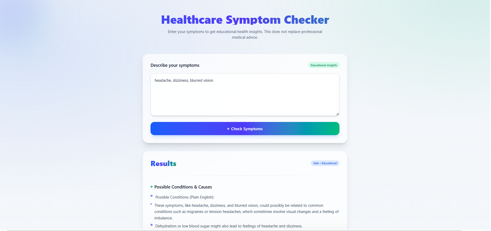

# Healthcare Symptom Checker

Monorepo:

- backend/
- frontend/

## Hosted Frontend

- Production (Vercel): https://healthcare-symptom-checker-unthinka-gamma.vercel.app/

## Preview



> Tip: If the image above doesn’t load, replace the URL with a screenshot hosted in your repo. For example:
>
> - Add your screenshot to `frontend/public/screenshot.png`
> - Then update the Markdown to:
>   ``

## Run Locally

### Backend (Node + Express)

```bash
cd backend
npm install
```

Create backend .env:

```
PORT=5000
GEMINI_API_KEY=YOUR_GEMINI_API_KEY
FRONTEND_URL=http://localhost:5173
# Optional:
MONGODB_URI=your-mongodb-uri
```

Start backend:

```bash
npm start
# API: http://localhost:5000
```

### Frontend (React + Vite + Tailwind)

```bash
cd ../frontend
npm install
```

Create frontend .env:

```
VITE_API_BASE=http://localhost:5000
```

Start frontend:

```bash
npm run dev
# App: http://localhost:5173
```
